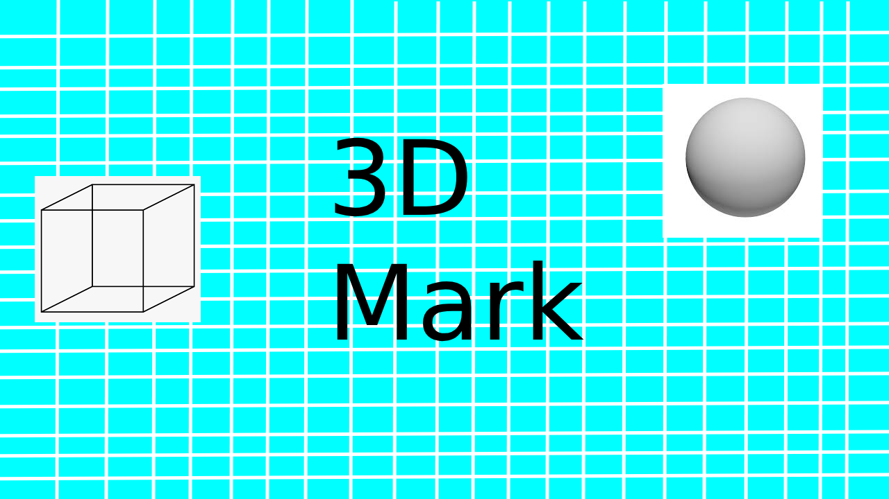

# 3D Mark
the open-source program for 3D Modeling for weak laptops and pc's



# Why is 3D Mark?
the 3D Mark project written by Wordey(Egor) Cherniavskij from scratch in October 2025 for now the 3D Mark in aplha 0.0.1 the fisrt alpha version

# How to Compile it?
for compiling you need bash or bash like shell(if you using windows the powershell), gcc

installing the apps:
debian:
```bash
    sudo apt install java-openjdk-17-jdk
```
arch linux:
```bash
    sudo pacman -S java17-openjdk
```
or
```bash
    sudo yay -S jdk17-openjdk
```
if you like yay

for windows you need manualy install gcc

Okey, lets compiling the 3D Mark
```bash
    git clone https://www.github.com/WordeyGoose/3DMark.git
    cd 3DMark
    make
```